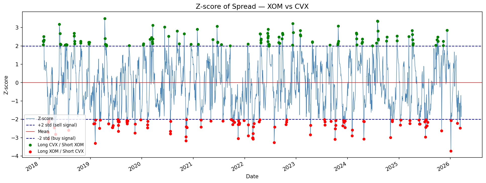
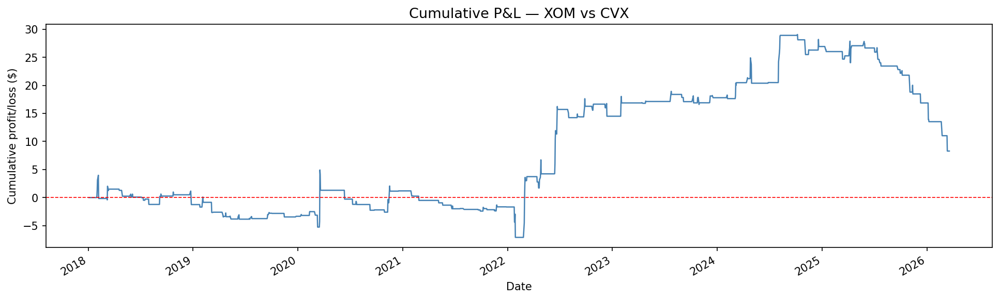
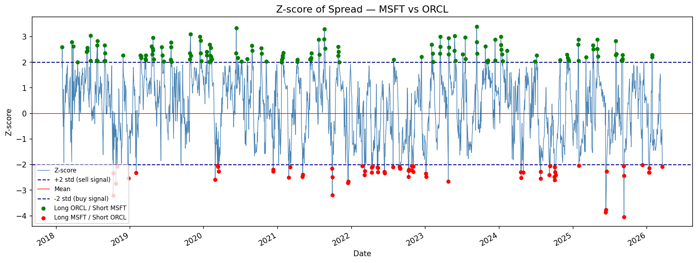
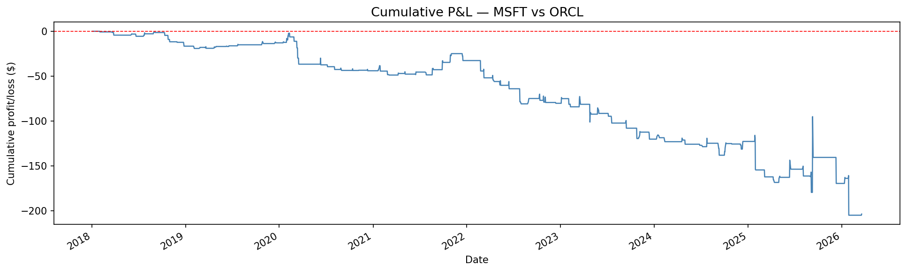
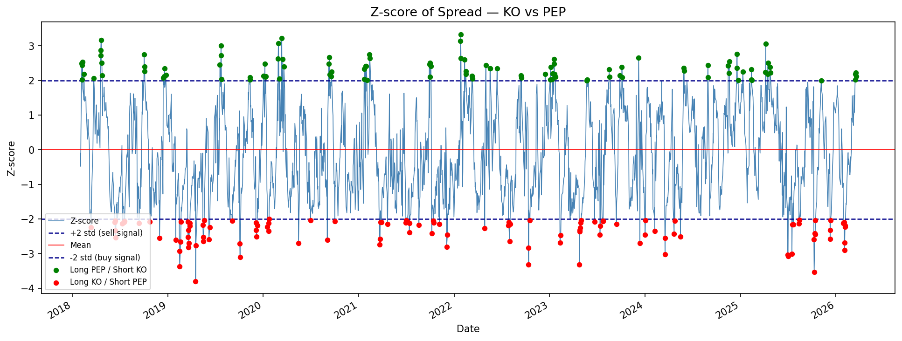
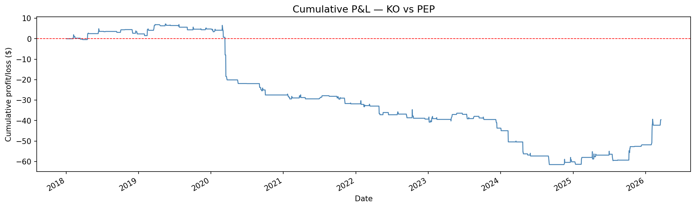

# Pairs Trading: Statistical Arbitrage

A Python implementation of a **pairs trading strategy** based on statistical arbitrage.
The strategy identifies when two historically correlated stocks diverge from their usual relationship,
and bets that the gap will close.

---

## How It Works

Pairs trading is built on one idea: if two stocks tend to move together, their price difference (the **spread**) should stay close to a stable mean. When it drifts too far, it is likely to revert and that temporary divergence is the trading opportunity.

The strategy runs in five steps:
1. **Spread**: compute the daily price difference between the two stocks
2. **Z-score**: normalize the spread using a 20-day rolling mean and standard deviation. This answers: *"how unusual is today's divergence compared to the recent past?"*
3. **Signal**: when the z-score crosses ±2 standard deviations, generate a trade signal
4. **P&L**: simulate the cumulative profit and loss of following those signals
5. **ADF Test**: statistically verify that the spread is mean-reverting before trusting the strategy

---

## Signals

| Z-score | Meaning | Trade |
|---------|---------|-------|
| > +2 | Spread unusually high — ticker1 overpriced | Short ticker1, Long ticker2 |
| < -2 | Spread unusually low — ticker1 underpriced | Long ticker1, Short ticker2 |
| between ±2 | No significant divergence | No trade |

---

## Results

### XOM vs CVX — Energy (strong cointegration)

Both stocks are driven by the same underlying factor: crude oil prices.
The spread is stationary and the strategy generates a positive P&L.

**Z-score with signals:**



**Cumulative P&L:**



```
ADF Statistic:  -3.31   (critical value at 5%: -2.86)
P-value:        0.014   Spread is stationary
Total P&L:      +8.29
Sharpe Ratio:   +0.13
```

---

### MSFT vs ORCL — Tech (no cointegration)

Microsoft and Oracle both operate in the cloud and enterprise software space,
but have very different business models and growth profiles. Despite appearing
correlated on the surface, their stock prices are driven by different investor
narratives and the numbers confirm it. The strategy loses from day one,
never generating a single period of cumulative profit.

**Z-score with signals:**



**Cumulative P&L:**



```
    ADF Statistic:  -1.63
    P-value:         0.47    Spread is NOT stationary
    Total P&L:      -203.73
    Max drawdown:   -205.04
```

---

### KO vs PEP — Beverages (breakdown after 2020)

The most intuitive pair: Coca-Cola and Pepsi compete in the same market
and are driven by similar consumer trends. Yet the strategy fails badly.

The reason: during the COVID crash (March 2020), KO collapsed while PEP held up:
KO depends on restaurants, bars and events (all closed), while PEP sells
through supermarkets. The spread never recovered. This is a **breakdown in
cointegration**: a structural regime change that permanently shifts the
relationship between two stocks.

**Z-score with signals:**



**Cumulative P&L:**



```
ADF Statistic:  -1.76
P-value:         0.40    Spread is NOT stationary
Total P&L:      -61.23
Sharpe Ratio:   -0.18
```

---

## How to Use

**Install dependencies:**
```bash
pip install yfinance pandas numpy matplotlib statsmodels
```

**Run the analysis:**
```python
pairs_trading("XOM", "CVX")
